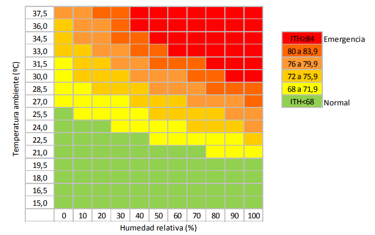

# 86.65 - Sistemas Embebidos - Control ITH
Proyecto de "Control de estrés en ganado por índice de temperatura y humedad (ITH)" desarrollado en la materia 86.65-Sistemas Embebidos de la facultad de Ingeniería de la Universidad de Buenos Aires -FIUBA.

- Desarrollado en Navarro Pcia. Bs As, Argentina  
- Desarrollo: Estudiante en Ing.Carlos Maximiliano Massone                                    

# Programa - Control ITH Wi-Fi
Sistema de automatizacion para control de estres por calor a través de indice de temperatura y humedad.

# Hardware Version Wi-Fi

* Placa de desarrollo EDU-CIAA-NXP
http://www.proyecto-ciaa.com.ar/devwiki/doku.php?id=desarrollo:edu-ciaa:edu-ciaa-nxp#:~:text=La%20EDU%2DCIAA%2DNXP%20es,ense%C3%B1anza%20universitaria%2C%20terciaria%20y%20secundaria.

* Placa de desarrollo NodeMCU Lolin
https://www.nodemcu.com/index_en.html#fr_54747661d775ef1a3600009e

* Display LCD 16x2 
https://naylampmechatronics.com/lcd-alfanumerico/110-display-alfanumerico-lcd-1602.html

* Modulo de comunicacion I2C para display LCD 16x2 
https://naylampmechatronics.com/lcd-alfanumerico/60-modulo-adaptador-lcd-a-i2c.html

* Sensor DHT11
https://naylampmechatronics.com/sensores-temperatura-y-humedad/57-sensor-de-temperatura-y-humedad-relativa-dht11.html

* Modulo de Relay SSR
https://naylampmechatronics.com/drivers/338-modulo-ssr-1ch-5vdc.html

